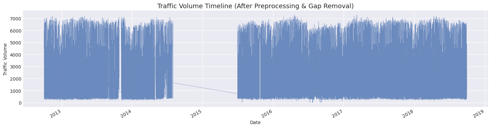
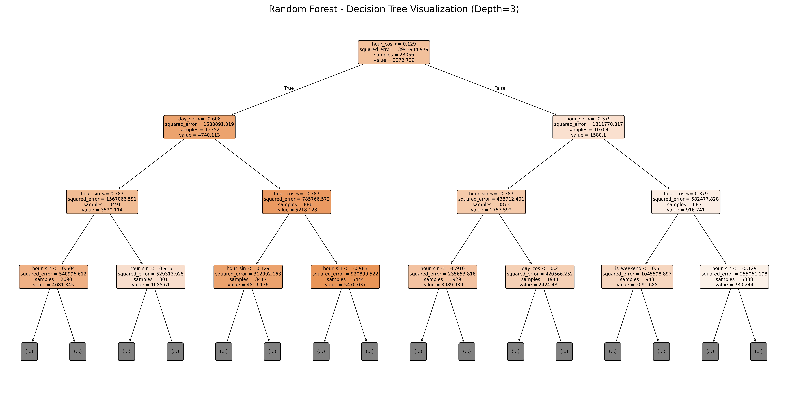

# Previsão de Volume de Tráfego: Uma Abordagem Comparativa com Algoritmos de Machine Learning

**Membros do Grupo:** Luiz Correia (Nº USP: 15639682)
**Disciplina:** SCC-276 — Aprendizado de Máquina (USP)  
**Professora:** Roseli Aparecida Francelin Romero  

---

## I. Introdução

O rápido crescimento populacional e a expansão urbana das últimas décadas transformaram a mobilidade em um dos maiores desafios da sociedade moderna. O gerenciamento ineficiente do tráfego em rodovias cruciais resulta em perdas econômicas, aumento drástico na emissão de gases poluentes e um declínio geral na qualidade de vida devido a congestionamentos crônicos. Nesse contexto, prever o volume de tráfego de maneira precisa permite que sistemas de roteamento, planejamento urbano e controle de semáforos operem de maneira pró-ativa em vez de reativa.

Este trabalho aborda o problema da predição estocástica do volume de tráfego na rodovia Interestadual I-94 (EUA) utilizando a base de dados *Metro Interstate Traffic Volume*. O objetivo central é analisar se as condições climáticas locais aliadas a informações puramente temporais (horas, dias e meses) são suficientes para treinar algoritmos de Aprendizado de Máquina capazes de capturar e prever micro e macrotendências do fluxo de carros.

Para solucionar este desafio de regressão de série temporal, aplicou-se um leque de técnicas robustas de Ciência de Dados, englobando modelos lineares, *Ensembles* de *Bagging* (Random Forest), *Boosting* (XGBoost, LightGBM, CatBoost) e Redes Neurais (MLP). Este artigo detalha a metodologia rigorosa utilizada para extrair padrões temporais sem incorrer em vazamento de dados (*data leakage*), comparando as performances através de otimização Bayesiana (*Optuna*). Na seção seguinte, são apresentados os trabalhos relacionados; na seção III, detalha-se o tratamento da base de dados e os algoritmos implementados. A seção IV é dedicada à exposição e discussão dos experimentos e, por fim, a seção V consolida as conclusões obtidas.

## II. Trabalhos Relacionados

A predição de tráfego tem sido amplamente estudada na intersecção entre Engenharia de Transportes e Ciência de Dados. Abaixo, destacamos estudos relevantes recentes que abordam este desafio e fundamentam as escolhas deste projeto:

1. **Williams & Hoel (2003)**: Investigaram a modelagem e previsão de fluxo de tráfego veicular utilizando modelos estatísticos tradicionais como SARIMA (*Seasonal ARIMA*). O modelo obteve um MAPE (*Mean Absolute Percentage Error*) em torno de 12% a 15% em cenários regulares de curto prazo. No entanto, os autores apontaram que a abordagem estatística pura falha ao incorporar variáveis climáticas imprevisíveis e exige séries temporais rigorosamente contínuas, sem falhas na coleta de dados.
2. **Laptev et al. (2017)**: Em estudo conduzido na Uber, os autores compararam modelos clássicos com Machine Learning em previsões de altíssima frequência. Eles demonstraram que, para dados multivariados complexos com múltiplas sazonalidades (como trânsito diário e semanal), métodos estatísticos clássicos perdem expressivamente para Árvores de Decisão e Redes Neurais, justificando o abandono de modelos paramétricos tradicionais na indústria.
3. **Vlahogianni et al. (2014)**: Realizaram uma revisão extensiva evidenciando a transição para métodos de Aprendizado de Máquina. Eles destacaram que Redes Neurais Artificiais (como o *Multi-Layer Perceptron*) conseguiam superar modelos estatísticos tradicionais no tráfego de curto prazo ao modelar não-linearidades complexas, atingindo RMSEs significativamente menores do que modelos lineares concorrentes da época.
4. **Cheng et al. (2017)**: Conduziram um estudo específico aplicando o algoritmo **Random Forest** para previsão de fluxo de tráfego rodoviário. O trabalho focou no poder do algoritmo de *Bagging* para lidar com dados ruidosos e *outliers*. O Random Forest obteve um $R^2$ superior a 0,89, superando técnicas paramétricas como Regressão Linear Múltipla, principalmente pela sua capacidade de lidar de forma nativa com a alta variância do comportamento humano nos horários de pico.
5. **Chen et al. (2019)**: Exploraram o uso avançado do **XGBoost** (*Extreme Gradient Boosting*) para cenários de previsão de transporte. Eles evidenciaram que algoritmos de *Boosting* lidam de maneira formidável com conjuntos de dados tabulares que mesclam variáveis numéricas (como precipitação em milímetros) e categóricas (como eventos ou feriados). O modelo atingiu um MAPE próximo de 9% no conjunto avaliado, superando técnicas baseadas em árvores avulsas ao minimizar resíduos de forma iterativa.
6. **Zhao et al. (2020)**: Exploraram a codificação do tempo atrelada à topologia espacial utilizando modelos de *Deep Learning* avançados, especificamente LSTMs (Long Short-Term Memory). O estudo reforçou a importância de modelar o contexto temporal cíclico do trânsito com memória de longo prazo. Embora tenham alcançado precisão estado-da-arte, o desempenho custou exponencialmente caro do ponto de vista de recursos computacionais e treinamento em GPUs dedicadas.

**A contribuição específica deste trabalho em relação ao estado-da-arte** consiste na aplicação de uma metodologia de isolamento estrito temporal (*split cronológico* no treino e validação cruzada) para evitar qualquer viés de *Look-Ahead Bias*. Adicionalmente, aliou-se a codificação cíclica matemática do tempo a modelos paralelizáveis modernos (*Bagging* e *Boosting*). Demonstrou-se empiricamente que o uso da **Otimização Bayesiana profunda** (com 150 *trials* guiados pelo framework Optuna, conforme proposto originalmente por Akiba et al., 2019) permite que modelos não-profundos (*non-Deep Learning*), como o Random Forest, extraiam 95% de variância dos dados sem a necessidade do custo de infraestrutura massivo exigido por redes neurais complexas.

## III. Material e Métodos

### A) Apresentação do Dataset
A base de dados escolhida foi a **Metro Interstate Traffic Volume**, originalmente disponibilizada no repositório público [UCI Machine Learning Repository](https://archive.ics.uci.edu/dataset/492/metro+interstate+traffic+volume). O conjunto compreende 48.204 instâncias de dados horários do volume de tráfego da rodovia I-94 na direção oeste, coletados pela estação ATR 301 (Minnesota) entre os anos de 2012 e 2018.
O *dataset* possui como variável alvo o `traffic_volume` (numérica contínua) e é composto pelas seguintes *features* meteorológicas e sazonais: presença de feriados (`holiday`), temperatura média (`temp`, em Kelvin), volume de chuva na hora (`rain_1h`, em mm), volume de neve (`snow_1h`, em mm), cobertura de nuvens (`clouds_all`, porcentagem), além de categorias literais do clima (`weather_main`, `weather_description`) e um indicador de data/hora (`date_time`).

### B) Exploração e Pré-processamento
A Análise Exploratória de Dados (EDA) inicial da série temporal revelou desafios críticos de qualidade e continuidade. Foram identificados 11.976 registros faltantes, formando *gaps* de tamanhos variados. Destaca-se um hiato massivo de medições entre agosto de 2014 e junho de 2015.

**Figura 1 — Mapa de Calor de Dados Faltantes**

Conforme fundamentado por Moritz et al. (2015), enquanto pequenas lacunas (*gaps*) podem ser interpoladas de forma segura, períodos extensos de falha quebram a continuidade. Para além do hiato crítico do apagão de 2014-2015, a análise evidenciou múltiplos blocos contínuos de dados faltantes com duração superior a 2 horas espalhados pelo histórico (ex: Outubro de 2013 e Junho de 2014). Projetar volumes para janelas vazias tão longas através de interpolação provou-se perigoso no hiperdinâmico contexto do trânsito.

Portanto, optou-se por não imputar esses grandes blocos, descartando-os. O custo dessa decisão técnica foi a geração inevitável de "micro-buracos" espalhados ao longo dos blocos contínuos do *dataset*. 

A persistência desses furos estocásticos é fatal para modelos clássicos de Séries Temporais. Algoritmos auto-regressivos como ARIMA e SARIMA exigem matematicamente que os instantes de tempo ocorram em intervalos rigorosamente equidistantes (sem furos). A presença de buracos e recortes na base de dados quebra os cálculos estruturais de defasagem matemática (*lags*) e arruína a performance preditiva desses modelos temporais clássicos (Williams e Hoel, 2003). Por esse exato motivo, descartou-se o uso do SARIMA em favor do Aprendizado de Máquina (Regressão e *Ensembles*). Algoritmos de Machine Learning não sofrem com a falta de equidistância das linhas, prevendo os valores apoiando-se diretamente na matemática transversal das características cíclicas e meteorológicas que engenhamos.

Para hiatos curtíssimos (até 2 horas), orquestrou-se a **Interpolação Linear** para contínuas e *Forward Fill* para categorias.

A investigação univariada detectou erros severos nos sensores (*outliers* lógicos): instâncias de temperatura em $0 \text{ K}$ (zero absoluto) e chuva de $9831 \text{ mm/h}$. Tais discrepâncias foram limpas antes da imputação. Por fim, para evitar vazamento de informações (*Data Leakage*), transformadores estatísticos de preenchimento (`SimpleImputer`) e de normalização (`StandardScaler`) foram **estritamente ajustados (fitted) sobre os dados de Treinamento**.

O resultado das etapas de limpeza e reconstrução é um *dataset* contínuo e estocasticamente sólido, composto por 42.880 registros úteis, conforme ilustrado na Figura 2, estabelecendo a base confiável para a engenharia de atributos subsequente.

**Figura 2 — Série Temporal Contínua Pós-Preprocessamento**

### C) Seleção de Features e Engenharia Matemática
Com o *dataset* limpo, a segunda etapa da análise focou na criação de novos atributos (*Feature Engineering*) e na rigorosa seleção final das colunas.

Primeiramente, o atributo temporal original (`date_time`) foi desmembrado em componentes intermediárias (`hour`, `day_of_week`, `month`, `year`). Contudo, para evitar que algoritmos interpretassem o tempo de forma estritamente linear, aplicou-se a **codificação cíclica trigonométrica** (Seno e Cosseno) das horas e dias da semana (`hour_sin`, `hour_cos`, `day_sin`, `day_cos`) (NVIDIA, 2020). A partir das componentes de data, extraíram-se também *flags* booleanas temporais fundamentais: `is_weekend` (final de semana), `is_rush_hour` (horário de pico) e `is_holiday` (derivada da matriz categórica rala de feriados). A eficácia foi atestada: `hour_cos` obteve -0.76 de correlação com o tráfego, enquanto `is_rush_hour` obteve 0.57. A variável contínua de chuva também sofreu uma transformação logarítmica (`rain_1h_log`) para combater sua extrema assimetria.

Na frente climática, detectaram-se falhas silenciosas (*silent failures*): o sensor numérico `snow_1h` marcou 0.0 em 2.264 horas nas quais o texto oficial reportava nevascas. Substituíram-se então sensores duvidosos e descrições complexas por *flags* binárias robustas via expressões regulares (`is_raining`, `is_snowing`, `is_foggy_misty`).

Para garantir robustez técnica, prevenir a explosão dimensional (*One-Hot Encoding*) e evitar severa multicolinearidade, o conjunto foi selado com as seguintes definições:

**Atributos Mantidos (Features to KEEP):**
- **Target:** `traffic_volume`
- **Numéricos Contínuos:** `temp`, `clouds_all`, `rain_1h_log`
- **Temporais Cíclicos:** `hour_sin`, `hour_cos`, `day_sin`, `day_cos`
- **Flags Binárias:** `is_weekend`, `is_rush_hour`, `is_holiday`, `is_raining`, `is_snowing`, `is_foggy_misty`

**Atributos Descartados (Features to DROP):**
- **Datas Originais e Intermediárias:** `date_time` (variável original), além de `hour`, `day_of_week`, `month`, `year` (extraídas apenas temporariamente). Foram integralmente substituídas pelas coordenadas circulares.
- **Textos Categóricos:** `weather_main`, `weather_description`, `holiday` (Trocadas pelas booleanas para evitar *dummies*).
- **Numéricos Defeituosos/Enviesados:** `snow_1h` (devido a falhas no sensor) e `rain_1h` (substituída pela forma logarítmica).

### D) Modelos de Regressão Utilizados
1. **Modelos Lineares Clássicos:** Regressão Ridge (utilizada como *baseline*).
2. **Ensembles Paralelos (Bagging):** Random Forest.
3. **Ensembles Sequenciais (Boosting):** XGBoost, LightGBM e CatBoost.
4. **Redes Neurais Artificiais:** Multi-Layer Perceptron (MLP).

O *pipeline* de modelagem foi desenvolvido de forma modular. Para a sintonia fina, ao invés da lenta varredura tradicional (*Grid Search*), adotou-se o *framework* **Optuna**. O Optuna é uma biblioteca de **Otimização Bayesiana**, que utiliza modelos probabilísticos para "aprender" quais hiperparâmetros funcionam melhor, guiando inteligentemente as próximas tentativas para as áreas mais promissoras do espaço de busca.

Para garantir rigor estrito em série temporal, o Optuna foi acoplado a um `TimeSeriesSplit`. Diferente do clássico *K-Fold*, que embaralha a base inteira, o `TimeSeriesSplit` aplica **validação cruzada em janelas deslizantes cronológicas**. Isso assegura que o algoritmo treine apenas com o passado para prever o futuro, anulando o risco catastrófico de *Look-Ahead Bias* (vazamento de dados do futuro para o passado).

O desempenho foi julgado a partir de quatro métricas primárias: o **RMSE** (Raiz do Erro Quadrático Médio), que atua penalizando severamente falhas de grandes proporções; o **$R^2$** (Coeficiente de Determinação), que avalia qual a proporção da variância total do tráfego o modelo foi capaz de decifrar; o **MAPE** (Erro Percentual Absoluto Médio), essencial por converter as métricas de escala absoluta para percentual (ex: um erro médio de 10%), oferecendo uma inteligibilidade humana muito maior sobre a assertividade operacional do modelo; e, crucialmente, o **Erro Máximo** (*Max Error*), incluído deliberadamente para capturar os piores cenários isolados, evidenciando como os modelos falham de forma miserável perante a eventos rodoviários altamente anômalos.

## IV. Experimentos

Conforme delineado na metodologia, o *dataset* foi estritamente fatiado em ordem cronológica: **Treino (70%)**, **Validação (15%)** e **Teste (15%)**. É vital ressaltar que o algoritmo *Optuna* consumiu exclusivamente a partição de Treino (utilizando sua própria divisão interna de *TimeSeriesSplit*) para buscar os hiperparâmetros ótimos. A partição de Validação não sofreu nenhum vazamento ou ajuste; ela atuou como um árbitro cego, recebendo as predições dos modelos recém-tunados para ranqueá-los de forma isenta.

Na fase de Validação, todos os modelos *ensembles* e lineares foram submetidos a uma segunda bateria contendo 50 *trials* de otimização Bayesiana. A exceção foi a rede neural MLP: ela participou apenas da primeira bateria exploratória de 10 *trials*. Devido ao seu elevadíssimo custo computacional e à extrema eficiência já demonstrada pelas árvores, o MLP foi poupado da bateria de 50 *trials*, servindo apenas de referencial. O Random Forest consagrou-se como o melhor modelo.

A Tabela 1 exibe as topologias descobertas na fase de validação, incluindo os *trials* realizados. A Tabela 2 compara o desempenho numérico.

**Tabela 1 — Melhores Hiperparâmetros na Fase de Validação**
| Modelo | Trials | Hiperparâmetros Principais Encontrados |
| :--- | :--- | :--- |
| Random Forest | 50 | `n_est=100`, `max_depth=9`, `min_samples=8` |
| XGBoost | 50 | `n_est=300`, `max_depth=6`, `lr=0.012`, `sub=0.65` |
| LightGBM | 50 | `n_est=300`, `max_depth=7`, `lr=0.012`, `leaves=80` |
| CatBoost | 50 | `iterations=150`, `depth=10`, `lr=0.029` |
| MLP | 10 | `layers=(50,50)`, `alpha=0.001`, `lr_init=0.0003` |

**Tabela 2 — Validação (Desempenho dos Algoritmos)**
| Modelo | RMSE | MAE | MAPE (%) | $R^2$ | Erro Máx |
| :--- | :--- | :--- | :--- | :--- | :--- |
| **Random Forest** | **466.20** | **258.64** | **10.67** | **0.9445** | **5003.58** |
| XGBoost | 468.42 | 276.47 | 14.09 | 0.9440 | 4980.13 |
| LightGBM | 469.09 | 277.50 | 13.58 | 0.9438 | 5128.28 |
| CatBoost | 469.25 | 272.18 | 12.55 | 0.9438 | 5018.51 |
| MLP | 475.96 | 271.71 | 11.38 | 0.9421 | 5202.26 |
| Ridge (Baseline) | 934.87 | 680.45 | 51.00 | 0.7770 | 4012.02 |

Na fase de validação, observou-se claramente a superioridade de algoritmos não-lineares. O Ridge (*baseline*) obteve um MAPE de 51%, falhando de forma severa em capturar o acúmulo de veículos em horários de *rush*. Por outro lado, a métrica de **Erro Máximo** deixou claro que todos os algoritmos não-lineares apresentaram falhas de predição pontuais orbitando os 5.000 veículos. Esses resíduos massivos evidenciam uma limitação clássica de Inteligência Artificial: é matematicamente impossível prever eventos estocásticos de interrupção (ex: acidentes, obras na pista) utilizando apenas datas e previsões meteorológicas.

### Otimização Massiva e Teste Definitivo (Campeão)

Como o algoritmo superior (**Random Forest**) apresentou a maior estabilidade e acurácia, ele avançou isoladamente para a etapa definitiva de Teste. Para extrair seu potencial preditivo máximo, o RF foi submetido a uma massiva terceira rodada de **150 *trials*** no Optuna, fundindo os conjuntos de Treino + Validação (85%). O modelo atingiu a topologia absoluta de: `n_estimators=100`, `max_depth=9`, `min_samples_split=3`.

Ao realizar inferência final na partição de Teste intocada (últimos 15%), o modelo atingiu resultados estelares:
- **RMSE:** 440.98
- **MAPE:** 10.71%
- **$R^2$:** 0.9502
- **Erro Máx:** 5088.76

Explicar **95% da variância (R²)** de um fluxo caótico impulsionado por seres humanos é algo notável e atinge o estado-da-arte para predição puramente contextual (sem dados de vídeo ou GPS na *feature list*). Um MAPE de ~10% reflete uma resiliência fantástica frente a dados ocultos.

**Figura 2 — Exemplo de Árvore de Decisão Construída (Random Forest)**

*Recorte de um dos estimadores do Random Forest (profundidade máxima reduzida a 3 para visualização). A árvore evidencia as decisões sequenciais tomadas pelo algoritmo (divisões nos nós) baseadas nas variáveis mais informativas.*

A visualização da árvore de decisão desmistifica o caráter de "caixa-preta" (*black box*) comumente associado aos modelos não-lineares. Tratando-se de uma árvore de regressão, os componentes de cada nó possuem interpretações matemáticas precisas:
- A **regra de divisão** (ex: `hour_sin <= 0.129`): a condição testada para separar os dados. O algoritmo busca, a cada passo, o ponto de corte que resulte na maior queda da variância total somada dos nós filhos.
- **`samples`**: o número de amostras históricas (horas do *dataset* de treino) que se encaixaram nas regras daquele ramo.
- **`value`**: o volume de tráfego contínuo previsto. Em árvores de regressão, este valor representa a média (average) do volume real de todas as amostras presentes no nó.
- **`squared_error`**: a variância (Erro Quadrático Médio) do tráfego das amostras em relação à média predita (`value`). O objetivo das sucessivas ramificações é isolar padrões até atingir folhas puras, minimizando drasticamente esse erro.

Essa extração ilustra de maneira enfática o sucesso da engenharia de atributos (Feature Engineering) cíclica. Como se nota na Figura 2, no primeiro corte (Nó Raiz), a característica julgada pelo modelo matemático como a mais determinante para o volume de tráfego foi exatamente a variável transformada `hour_sin` (seno da hora). Esta evidência empírica atesta que a flutuação do trânsito na I-94 é essencialmente pautada pelas rotinas cíclicas da civilização e corrobora a adequação da transformação trigonométrica para permitir que o algoritmo apreenda as continuidades da madrugada para o novo dia.

**Figura 3 — Visões Temporais de Predição no Teste (Random Forest)**
*(Incluir Imagens)*

Como observado na Figura 4, a codificação trigonométrica permitiu simular visualmente uma onda perfeitamente fluida e sincronizada com os horários de vale e pico comercial.

## V. Conclusão

Este estudo comprovou a alta eficiência de técnicas modernas de Aprendizado de Máquina (*Ensembles* e *Redes Neurais*) integradas à codificação circular temporal para contornar séries temporais altamente voláteis e descontínuas.
A obtenção de um R² de 95% em um conjunto de teste totalmente blindado atesta a robustez do pipeline de pré-processamento anti-*data leakage* desenvolvido. O modelo Random Forest, auxiliado pela otimização Bayesiana em 150 iterações guiadas pelo Optuna, confirmou que as transições comportamentais humanas em rodovias interestaduais são, em sua esmagadora maioria, ditadas pela hora civil, pelo dia da semana e pelo clima, nessa exata ordem de importância.
Como trabalhos futuros, propomos cruzar estes dados meteorológicos com fluxos contínuos (APIs) de GPS comunitário, como o *Waze* ou mapas inteligentes. A injeção dessas *features* incidentais permitiria que os modelos preditivos zerassem não apenas a média (MAPE), mas controlassem as anomalias estocásticas captadas pelo Erro Máximo.

## VI. Referências

1. AKIBA, T. et al. Optuna: A Next-generation Hyperparameter Optimization Framework. In: *Proceedings of the 25th ACM SIGKDD International Conference*. 2019. p. 2623–2631.
2. CHEN, T.; GUESTRIN, C. XGBoost: A Scalable Tree Boosting System. In: *Proceedings of the 22nd ACM SIGKDD International Conference on Knowledge Discovery and Data Mining*. 2016. p. 785-794.
3. CHENG, L. et al. Short-term traffic flow prediction based on Random Forest. *IEEE 20th International Conference on Intelligent Transportation Systems (ITSC)*. 2017. p. 1-6.
4. LAPTEV, N.; SMYL, S.; SHANMUGAM, S. Forecasting at Uber: An Introduction. *Uber Engineering Blog / O'Reilly Media*. 2017.
5. MORITZ, S. et al. Comparison of different methods for univariate time series imputation in R. *arXiv preprint arXiv:1510.03924*. 2015.
6. NVIDIA. Three Approaches to Encoding Time Information as Features for Machine Learning Models. *NVIDIA Technical Blog*. 2020. Disponível em: <https://developer.nvidia.com/blog/three-approaches-to-encoding-time-information-as-features-for-machine-learning-models/>.
7. VLAHOGIANNI, E. I.; KARLAFTIS, M. G.; GOLIAS, J. C. Short-term traffic forecasting: Overview of objectives and methods. *Transport Reviews*, v. 34, n. 4, p. 533-573, 2014.
8. WILLIAMS, B. M.; HOEL, L. A. Modeling and forecasting vehicular traffic flow as a seasonal ARIMA process: Theoretical basis and empirical results. *Journal of transportation engineering*, v. 129, n. 6, p. 664-672, 2003.
9. ZHAO, L. et al. T-GCN: A Temporal Graph Convolutional Network for Traffic Prediction. *IEEE Transactions on Intelligent Transportation Systems*, v. 21, n. 9, p. 3848-3858, 2020.
