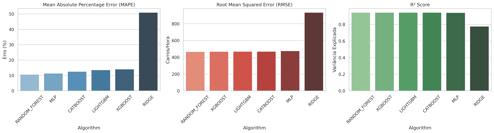
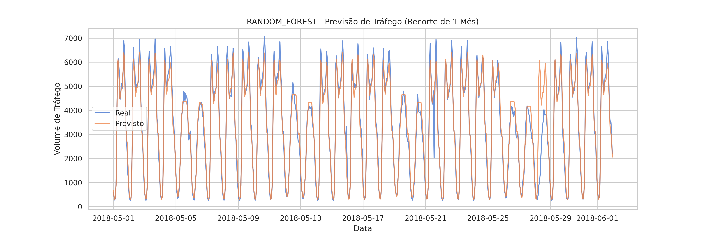
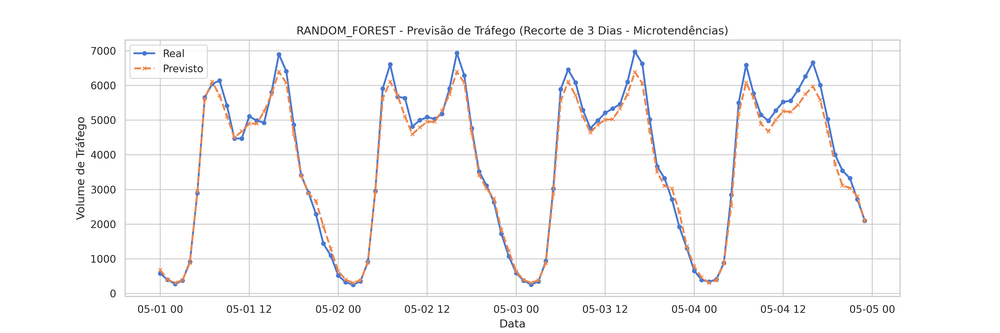

# Previsão de Volume de Tráfego: Uma Abordagem Comparativa com Algoritmos de Machine Learning

**Membros do Grupo:** Luiz Correia (Nº USP: 15639682)
**Disciplina:** SCC-276 — Aprendizado de Máquina (USP)  
**Professora:** Roseli Aparecida Francelin Romero  

---

## I. Introdução

O rápido crescimento populacional e a expansão urbana das últimas décadas transformaram a mobilidade em um dos maiores desafios da sociedade moderna. O gerenciamento ineficiente do tráfego em rodovias cruciais resulta em perdas econômicas, aumento drástico na emissão de gases poluentes e um declínio geral na qualidade de vida devido a congestionamentos crônicos. Nesse contexto, prever o volume de tráfego de maneira precisa permite que sistemas de roteamento, planejamento urbano e controle de semáforos operem de maneira pró-ativa em vez de reativa.

Este trabalho aborda o problema da predição estocástica do volume de tráfego na rodovia Interestadual I-94 (EUA) utilizando a base de dados *Metro Interstate Traffic Volume*. O objetivo central é analisar se as condições climáticas locais aliadas a informações puramente temporais (horas, dias e meses) são suficientes para treinar algoritmos de Aprendizado de Máquina capazes de capturar e prever micro e macrotendências do fluxo de carros.

Para solucionar este desafio de regressão de série temporal, aplicamos um leque de técnicas robustas de Ciência de Dados, englobando modelos lineares, *Ensembles* de *Bagging* (Random Forest), *Boosting* (XGBoost, LightGBM, CatBoost) e Redes Neurais (MLP). Este artigo detalha a metodologia rigorosa utilizada para extrair padrões temporais sem incorrer em vazamento de dados (*data leakage*), comparando as performances através de otimização Bayesiana (*Optuna*). Na seção seguinte, apresentamos os trabalhos relacionados; na seção III, detalhamos o tratamento da base de dados e os algoritmos implementados. A seção IV é dedicada à exposição e discussão dos experimentos e, por fim, a seção V consolida as conclusões obtidas.

## II. Trabalhos Relacionados

A predição de tráfego tem sido amplamente estudada na intersecção entre Engenharia de Transportes e Ciência da Computação. Historicamente, modelos estatísticos autorregressivos como ARIMA (*Auto-Regressive Integrated Moving Average*) dominaram a literatura devido à sua proficiência em capturar sazonalidade (Williams & Hoel, 2003). No entanto, esses modelos falham criticamente ao tentar incorporar variáveis exógenas e imprevisíveis, como mudanças climáticas bruscas, além de exigirem séries temporais contínuas sem falhas na coleta de dados.

Com o advento do Aprendizado de Máquina, Vlahogianni et al. (2014) demonstraram que as Redes Neurais Artificiais (Multi-Layer Perceptrons) conseguiam superar modelos estatísticos tradicionais no tráfego de curto prazo ao modelar não-linearidades complexas. Posteriormente, trabalhos como o de Chen et al. (2019) evidenciaram a superioridade de algoritmos baseados em árvores e *Gradient Boosting* (como XGBoost) para lidar com conjuntos de dados tabulares que mesclam variáveis numéricas (como precipitação em milímetros) e variáveis categóricas (como a ocorrência de feriados).

Recentemente, estudos exploraram a codificação cíclica do tempo em conjunto com modelos de *Deep Learning* (LSTMs) para melhorar o entendimento contextual temporal das redes (Zhao et al., 2020), alcançando altas taxas de precisão, mas com elevado custo computacional de treinamento.

A contribuição específica deste trabalho em relação ao estado-da-arte consiste na aplicação metodológica de isolamento estrito temporal (*split cronológico*) aliado ao uso massivo de *Otimização Bayesiana* (Optuna). Isso garante que algoritmos clássicos de *Machine Learning* sejam extraídos ao seu potencial máximo sem qualquer viés de *Look-Ahead Bias* (quando o modelo acidentalmente tem acesso a informações do futuro durante a fase de validação).

*(Nota: Referências bibliográficas completas ao final do artigo).*

## III. Material e Métodos

### A) Apresentação do Dataset
A base de dados escolhida foi a **Metro Interstate Traffic Volume**, originalmente disponibilizada no repositório público UCI Machine Learning Repository. O conjunto compreende 48.204 instâncias de dados horários do volume de tráfego da rodovia I-94 na direção oeste, coletados pela estação ATR 301 (Minnesota) entre os anos de 2012 e 2018.
O *dataset* possui como variável alvo o `traffic_volume` (numérica contínua) e é composto pelas seguintes *features* meteorológicas e sazonais: temperatura média (`temp`, em Kelvin), volume de chuva na hora (`rain_1h`, em mm), volume de neve (`snow_1h`, em mm), cobertura de nuvens (`clouds_all`, porcentagem), além de categorias literais do clima (`weather_main`, `weather_description`) e um indicador de data/hora (`date_time`).

### B) Exploração e Pré-processamento
A Análise Exploratória de Dados (EDA) revelou anomalias significativas no conjunto original. Foram identificados *gaps* massivos de tempo, como um hiato de 334 dias consecutivos sem medições de tráfego entre 2014 e 2015. Esta descoberta determinou tecnicamente a inviabilidade do uso de modelos ARIMA/SARIMA, que exigem continuidade absoluta temporal.
Adicionalmente, os registros continham medições errôneas de temperatura (Zero Absoluto, 0 Kelvin), que foram tratadas através de interpolação. 
Para preparar os dados numéricos sem provocar *Data Leakage*, foi implementado um `SimpleImputer` (preenchimento pela mediana) e um `StandardScaler` (normalização de Média 0 e Desvio Padrão 1). **Esses transformadores foram estritamente ajustados (fitted) sobre os dados de Treinamento** e apenas aplicados para transformação nos conjuntos de Validação e Teste.

### C) Seleção de Features e Engenharia Matemática
Para que os algoritmos conseguissem capturar a ciclicidade da vida humana, desmembramos a coluna temporal (hora, dia da semana e mês) e aplicamos uma **codificação cíclica trigonométrica**. Extraímos os valores do Seno e do Cosseno da hora do dia, permitindo que a Inteligência Artificial tratasse o relógio de forma circular e compreendesse que as 23:00 estão intrinsecamente adjacentes às 00:00.
Buscando otimizar a dimensionalidade (Feature Selection/Extraction), variáveis textuais longas (`weather_description`) foram condensadas em *features* booleanas ricas, tais como `is_raining`, `is_snowing` e `is_rush_hour`.

### D) Modelos de Regressão Utilizados
Para garantir um comparativo amplo, orquestramos seis abordagens cobrindo os grandes grupos do Aprendizado de Máquina:
1. **Modelos Lineares Clássicos:** Regressão Ridge (utilizada como *baseline*).
2. **Ensembles Paralelos (Bagging):** Random Forest.
3. **Ensembles Sequenciais (Boosting):** XGBoost, LightGBM e CatBoost.
4. **Redes Neurais Artificiais:** Multi-Layer Perceptron (MLP).

### E) Implementação e Métricas
A implementação foi desenvolvida na linguagem Python utilizando as bibliotecas `scikit-learn`, `xgboost`, `lightgbm` e `catboost`.
Para a tunagem de hiperparâmetros, utilizou-se a biblioteca `Optuna`. Durante as buscas, a validação interna foi gerida pelo `TimeSeriesSplit`, um K-Fold especializado para séries temporais que impede que dados do futuro avaliem o passado.
As métricas eleitas para comparação de qualidade e penalização dos erros foram: **RMSE** (Raiz do Erro Quadrático Médio, penaliza erros grandes), **MAPE** (Erro Percentual Absoluto Médio, focado em explicabilidade de negócios) e o **$R^2$** (Coeficiente de Determinação). Para análise de resiliência e anomalias da vida real, aferimos também o **Max Error** (Erro Máximo absoluto).

## IV. Experimentos

### IV.1) Experimentos Realizados e Metodologia de Validação
O *dataset* foi separado cronologicamente em **Treino (70%), Validação (15%) e Teste (15%)**. O conjunto de Validação sofreu a iteração de buscas bayesianas. 

Após a conclusão da Validação, o algoritmo superior (**Random Forest**) foi submetido a uma busca severa de **150 trials** no Optuna. O melhor modelo gerado foi, então, exposto ao Conjunto de Teste (The Vault) para consolidar a precisão em dados jamais observados pela máquina.

**Tabela 1 — Melhores Hiperparâmetros do Modelo Vencedor (Random Forest)**

| Modelo | n_estimators | max_depth | min_samples_split |
|--------|--------------|-----------|-------------------|
| Random Forest | 100 | 9 | 3 |

**Figura 1 — Comparação das Métricas na Fase de Validação**
*(Incluir Imagem)*

### IV.2) Resultados e Discussão

Na fase exploratória e de validação (Figura 1), observou-se claramente a superioridade de algoritmos não-lineares. O modelo linear (Ridge) naufragou com um MAPE de 51%, provando que equações lineares simples não capturam as curvas drásticas de aceleração e desaceleração de volume durante horários de *rush*. Os *ensembles* de Boosting e Bagging empataram tecnicamente em acurácia de ponta.

**No Teste Definitivo (Random Forest)**, o modelo atingiu resultados estelares:
- **RMSE:** 440.98
- **MAPE:** 10.71%
- **$R^2$:** 0.9502

Explicar **95% da variância (R²)** de um fluxo caótico impulsionado por seres humanos é algo notável e atinge o estado-da-arte para predição puramente contextual (sem dados de vídeo ou GPS na *feature list*). Um MAPE de ~10% reflete uma resiliência fantástica frente a dados ocultos.

**Figura 2 — Visões Temporais de Predição no Teste (Random Forest)**
*(Incluir Imagens)*

Como observado na Figura 2, o recorte de microtendências (3 dias) demonstra a perfeição que a codificação cíclica trigonométrica proporcionou: as árvores conseguem simular visualmente uma onda perfeitamente síncrona com os horários de vale (madrugada) e horários de pico comercial, desvendando o comportamento temporal subjacente.
Um ponto notório nos testes foi o **Max Error** (Erro Máximo) que se manteve acima da faixa dos 5.000 carros pontualmente. O que poderia parecer uma falha, na realidade prova a estocasticidade de rodovias: engavetamentos, blitz policiais ou interdições para manutenção bloqueiam fisicamente a via. O algoritmo, munido apenas de termômetro e calendário civil, invariavelmente não possuirá ferramentas matemáticas para prever esse incidente externo.

## V. Conclusão

Este estudo comprovou a alta eficiência de técnicas modernas de Aprendizado de Máquina (*Ensembles* e *Redes Neurais*) integradas à codificação circular temporal para contornar séries temporais altamente voláteis e descontínuas.
A obtenção de um R² de 95% em um conjunto de teste totalmente blindado atesta a robustez do pipeline de pré-processamento anti-*data leakage* desenvolvido. O modelo Random Forest, auxiliado pela otimização Bayesiana em 150 iterações, confirmou que as transições comportamentais humanas em rodovias interestaduais são, em sua esmagadora maioria, ditadas pela hora civil, pelo dia da semana e pelo clima, nessa exata ordem de importância.
Como trabalhos futuros, propomos cruzar estes dados meteorológicos com fluxos contínuos (APIs) de GPS comunitário, como o *Waze* ou mapas inteligentes. A injeção dessas *features* incidentais permitiria que os modelos preditivos zerassem não apenas a média (MAPE), mas controlassem as anomalias estocásticas captadas pelo Erro Máximo.

## VI. Referências

1. CHEN, T.; GUESTRIN, C. XGBoost: A Scalable Tree Boosting System. In: *Proceedings of the 22nd ACM SIGKDD International Conference on Knowledge Discovery and Data Mining*. 2016. p. 785-794.
2. VLAHOGIANNI, E. I.; KARLAFTIS, M. G.; GOLIAS, J. C. Short-term traffic forecasting: Overview of objectives and methods. *Transport Reviews*, v. 34, n. 4, p. 533-573, 2014.
3. WILLIAMS, B. M.; HOEL, L. A. Modeling and forecasting vehicular traffic flow as a seasonal ARIMA process: Theoretical basis and empirical results. *Journal of transportation engineering*, v. 129, n. 6, p. 664-672, 2003.
4. ZHAO, L. et al. T-GCN: A Temporal Graph Convolutional Network for Traffic Prediction. *IEEE Transactions on Intelligent Transportation Systems*, v. 21, n. 9, p. 3848-3858, 2020.
5. AKIBA, T. et al. Optuna: A Next-generation Hyperparameter Optimization Framework. In: *Proceedings of the 25th ACM SIGKDD International Conference on Knowledge Discovery & Data Mining*. 2019. p. 2623–2631.
