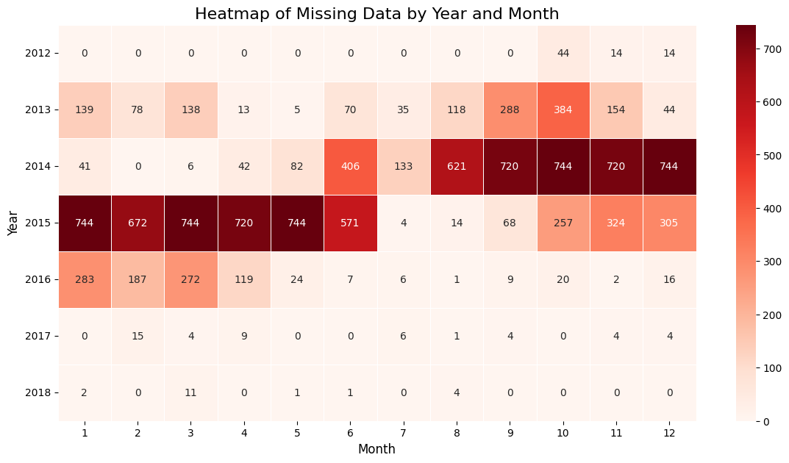

the data was collected from October 2012 to September 2018 adn there are 48,204 records.

There are 7629 duplicate records, but we aggregated the timestamps by the following rules:
```output
Number of duplicate rows (by index): 7629
Aggregation rules defined:
{'temp': 'mean', 'rain_1h': 'mean', 'snow_1h': 'mean', 'clouds_all': 'mean', 'traffic_volume': 'mean', 'holiday': 'first', 'weather_main': 'first', 'weather_description': 'first'}
------------------------------------------------------------
Original number of rows: 48204
Number of rows after aggregation: 40575
Number of duplicate timestamps now: 0
```

Since the data was collected at an hourly frequency and between October 2012 and September 2018, must be exist 52,551 records since the first timestamp at 2012-10-02 09:00:00 and the last timestamp at 2018-09-30 23:00:00. However, there are only 40,575 records after aggregation, which means that there are 11,976 missing records. This is a significant amount of missing data, which may affect the accuracy of any predictive models built using this dataset.

To understand the missing data, i searched for patterns in the missing timestamps. And no patterns were found by the day of the week and month. However, there is a pattern by year, because the period  08/2014 to 06/2015 has a significant amount of missing timestamps. 

So, I decided to remove timestamps from 08/2014 to 06/2015, that will be done in the preprocessing phase. The reason for this decision is that attempting to impute or fill in the missing data for this period could introduce bias or inaccuracies into the dataset. Furthermore, not removing the data from this period breaks temporal continuity, which is crucial for time series analyses. 

Image of the missing timestamps by year and month (heatmap):



Another question that arises is do the others timestamps at other periods with many missing observations need to be dropped too?

The other periods with many missing observations are: 

```output
Months with >20% missing data (excluding critical period 08/2014-06/2015):
Year  Month
2013  9        40.000000
      10       51.612903
      11       21.388889
2014  6        56.388889
2015  10       34.543011
      11       45.000000
      12       40.994624
2016  1        38.037634
      2        26.867816
      3        36.559140
```

[NEXT_STEPS]

- Plot missing timestamps of the months with >20% missing data (excluding critical period 08/2014-06/2015)
- Gap Size Analysis: 


