# Exploration Insights

The data was collected from October 2012 to September 2018 and there are 48,204 records.

There are 7,629 duplicate records, but we aggregated the timestamps by the following rules:
```output
Number of duplicate rows (by index): 7629
Aggregation rules defined:
{'temp': 'mean', 'rain_1h': 'mean', 'snow_1h': 'mean', 'clouds_all': 'mean', 'traffic_volume': 'mean', 'holiday': 'first', 'weather_main': 'first', 'weather_description': 'first'}
------------------------------------------------------------
Original number of rows: 48204
Number of rows after aggregation: 40575
Number of duplicate timestamps now: 0
```

Since the data was collected at an hourly frequency between October 2012 and September 2018, there must exist 52,551 records since the first timestamp is at `2012-10-02 09:00:00` and the last timestamp is at `2018-09-30 23:00:00`. However, there are only 40,575 records after aggregation, which means that there are 11,976 missing records. This is a significant amount of missing data, which may affect the accuracy of any predictive models built using this dataset.

To understand the missing data, I searched for patterns in the missing timestamps. No patterns were found by the day of the week or month. However, there is a pattern by year, because the period from **08/2014 to 06/2015** has a significant amount of missing timestamps. 

So, I decided to remove timestamps from 08/2014 to 06/2015, which will be done in the preprocessing phase. The reason for this decision is that attempting to impute or fill in the missing data for this period could introduce bias or inaccuracies into the dataset. Furthermore, not removing the data from this period breaks temporal continuity, which is crucial for time series analyses. 

Image of the missing timestamps by year and month (heatmap):


Another question that arises is do the others timestamps at other periods with many missing observations need to be dropped too?

The other periods with many missing observations are: 

```output
Months with >20% missing data (excluding critical period 08/2014-06/2015):
Year  Month
2013  9        40.000000
      10       51.612903
      11       21.388889
2014  6        56.388889
2015  10       34.543011
      11       45.000000
      12       40.994624
2016  1        38.037634
      2        26.867816
      3        36.559140
```

Plotting the missing timestamps of the months with >20% missing data (excluding critical period 08/2014-06/2015) will help to visualize the extent of the missing data and determine if any further action is needed.

### Missing Data Gaps Visualizations

**2013-09**
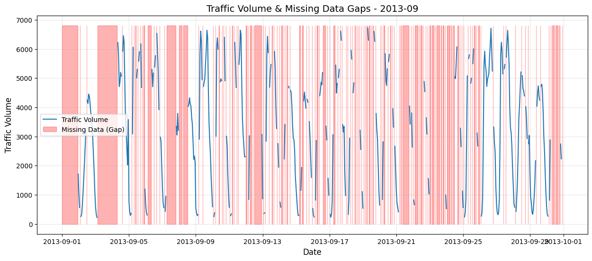

**2013-10**
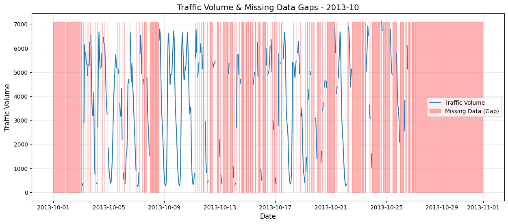

**2013-11**
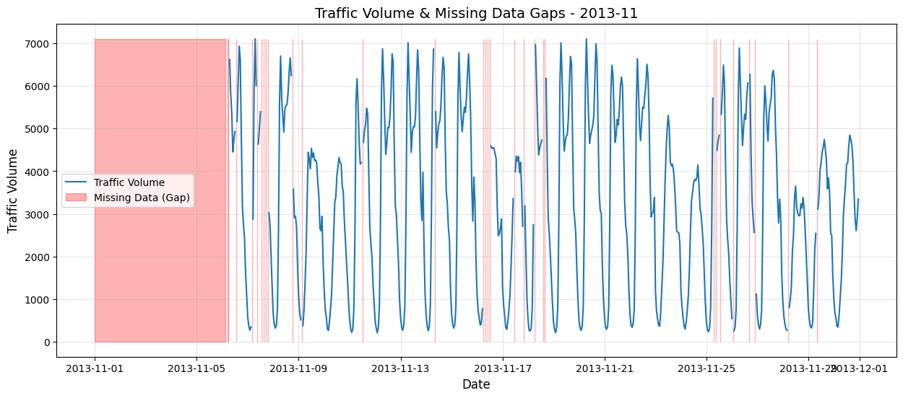

**2014-06**
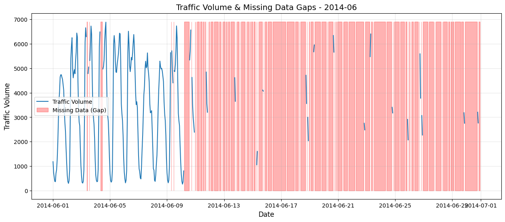

**2015-10**
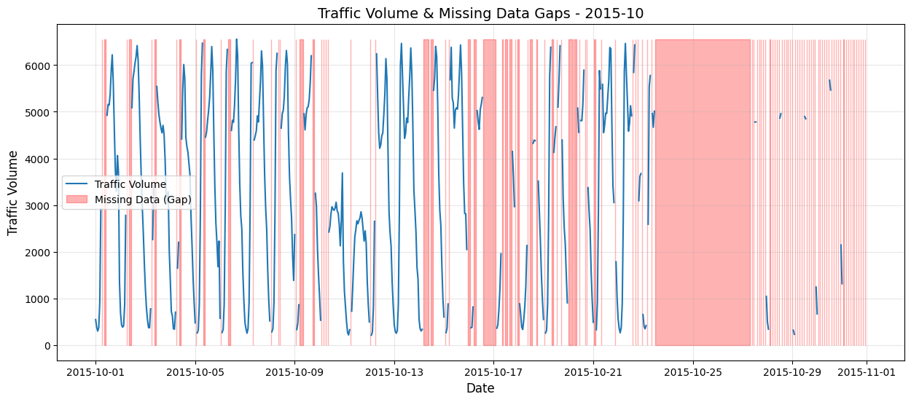

**2015-11**
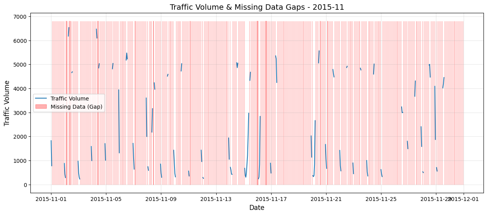

**2015-12**
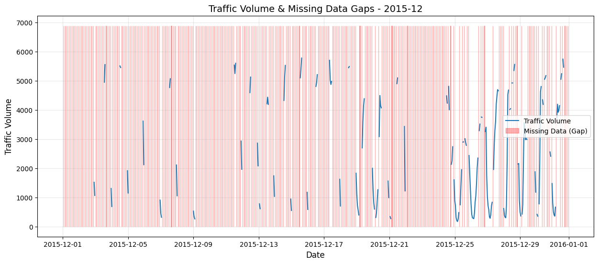

**2016-01**
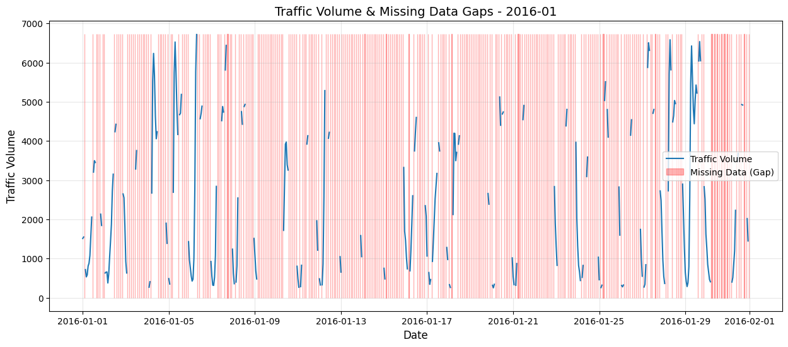

**2016-02**
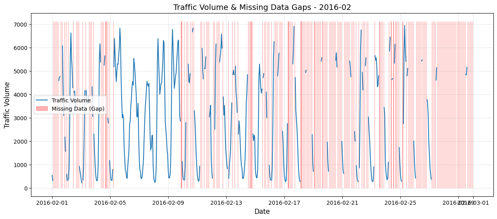

**2016-03**
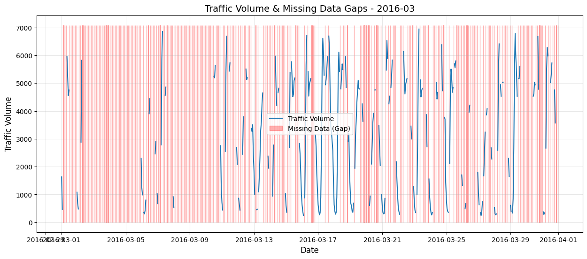


## Gap Size Analysis (excluding critical period 08/2014-06/2015):

The analysis above categorizes the missing data into continuous gaps and analyzes their sizes. This is crucial for deciding on an imputation strategy.

**Findings:**
*   **Many Small Gaps:** The distribution shows a large number of very small gaps (1-2 hours).
*   **Fewer Large Gaps:** There are progressively fewer gaps as the size increases.
**Proposed Strategy:**
1.  **Impute Small Gaps (<= 2 hours):** Gaps of 1 or 2 hours are small enough that imputation (e.g., using the mean of the surrounding values or a more sophisticated method like seasonal decomposition) is a reasonable approach. This will fill in minor holes in the data without introducing significant bias.
2.  **Discard Data for Large Gaps (> 2 hours):** For larger gaps, imputation becomes risky. The traffic patterns over several hours can be complex (e.g., rush hour peaks, nighttime lulls), and simply filling them in with a simple metric could distort the data. Therefore, for any gap larger than 2 hours, it is safer to treat that period as missing and not use it for training models that require continuous data. This might mean dropping the data around these gaps or splitting the dataset into multiple continuous segments.
This two-pronged approach allows us to retain as much data as possible by filling in minor gaps while avoiding the introduction of synthetic and potentially misleading data for longer and more significant periods of missing observations. The implementation of this strategy will be handled in the data preprocessing.

## Exploratory Data Analysis (EDA) Insights

### Univariate Analysis

#### Temperature (temp)

I noticed that there are instances where the temperature is recorded as 0 K, which is physically impossible. This indicates potential data quality issues that need to be addressed. So we checked and there are 10 instances with temp = 0 K. I will need to remove these instances from the dataset before the imputation of missing values, as they are likely to skew the results and lead to inaccurate conclusions. So they are going to be removed in the preprocessing phase but the gaps created by their removal will be imputed later.

```output
--- Analysis of 'temp' without outlier (0 K) ---
count    40565.000000
mean       281.385232
std         13.093822
min        243.390000
25%        271.840000
50%        282.865000
75%        292.280000
max        310.070000
Name: temp, dtype: float64
```

Graphical representation of the temperature distribution (without outlier 0 K):
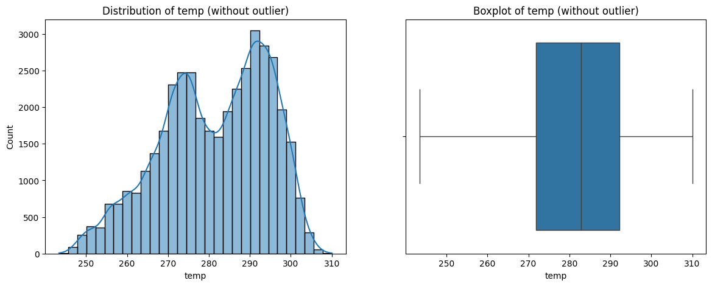

#### Rainfall (rain_1h)

There is a outlier in the 'rain_1h' variable with a value of 9831.3 mm, which is extremely high and likely represents a data error or anomaly. There is only one instance with this value. Because of that, I will remove this instance from the dataset before the imputation of missing values, as it is likely to skew the results and lead to inaccurate conclusions. So it is going to be removed in the preprocessing phase but the gap created by its removal will be imputed later.


```output
--- Analysis of 'rain_1h' without outlier (9831.3 mm) ---
count    40564.000000
mean         0.076351
std          0.769716
min          0.000000
25%          0.000000
50%          0.000000
75%          0.000000
max         55.630000
Name: rain_1h, dtype: float64
```

Graphical representation of the rainfall distribution (without outlier 9831.3 mm):
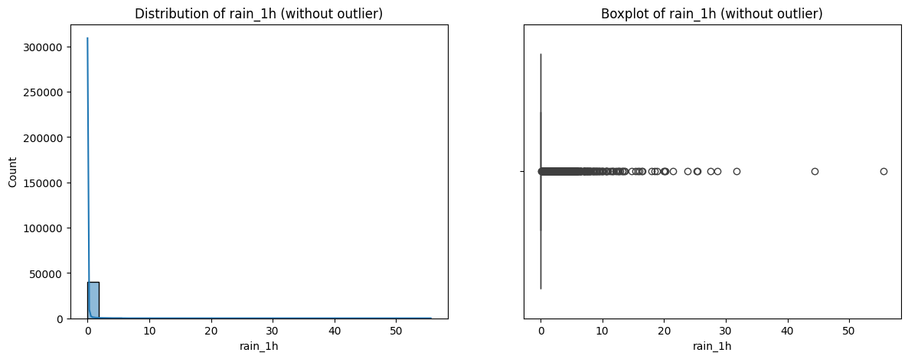

After removing the extreme outlier (impossible value of ~9831 mm), the analysis of the `rain_1h` variable reveals a distribution highly concentrated at zero (no rain), characteristic of sporadic meteorological phenomena.

**Key Observations:**

1.  **Predominance of Zeros (Sparsity):**
    * Descriptive statistics indicate that the **minimum**, **25% (Q1)**, **50% (Median)**, and **75% (Q3)** are all equal to `0.00`.
    * This means that in **more than 75% of the recorded hours**, there was no precipitation. The variable is "zero-inflated".

2.  **Skewness:**
    * The distribution is **strongly right-skewed**.
    * The mean (`0.076`) is higher than the median (`0.0`), pulled by extreme rain values, but it is still a low value due to the large number of zeros.

3.  **Outlier Analysis (Boxplot):**
    * The *Boxplot* appears "collapsed" at zero because the Interquartile Range (IQR) is 0.
    * All values where `rain_1h > 0` are visually plotted as *outliers* (the circles in the chart). However, the maximum value of **55.63 mm** (classified as *Violent Rain*) is a plausible meteorological data point for severe storms, representing an extreme event ("Natural Outlier") and not necessarily a measurement error.

**Conclusion for Modeling:**
Due to high sparsity, this variable may have little predictive power in its pure continuous form for linear models (which assume normality). It may be beneficial to test:
* A binary transformation (e.g., `is_raining`: 0 or 1).
* A categorization (e.g., No Rain, Light Rain, Heavy Rain) that is more interpretable and may capture non-linear relationships with traffic volume. For example, a light rain could have a different impact on traffic than heavy rain, and this categorization could help capture those nuances in the model.

#### Analysis of 'snow_1h'

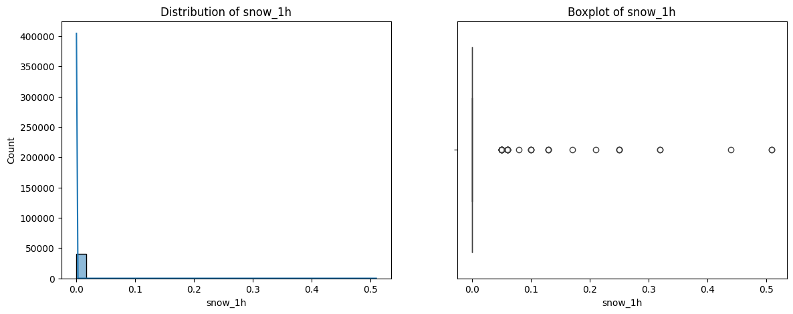

The analysis of the `snow_1h` variable reveals a distribution that is **extremely sparse**, even more so than the rain data. The values are heavily concentrated at zero with very low magnitude variations when positive.

**Key Observations:**

1.  **Extreme Sparsity (Zero-Inflation):**
    * Similar to the rain data, the **minimum**, **25%**, **50%**, and **75%** quartiles are all `0.00`.
    * The mean (`0.000117`) is exceedingly close to zero. This indicates that snowfall (as a measured quantity) is a rare event in this dataset, or often recorded as 0 even when present (trace amounts).

2.  **Low Magnitude of Values:**
    * Unlike the rain variable (which reached ~55 mm), the **maximum value** for snow is only **0.51 mm**.
    * This suggests that the variable likely represents the **liquid equivalent** of snow (melted) or that significant snowfall accumulation is rarely captured in this specific column. The range of data (0.0 to 0.51) is extremely narrow.

3.  **Distribution Structure:**
    * **Skewness:** The distribution is heavily right-skewed.
    * **Boxplot Analysis:** The boxplot is completely "collapsed" at zero. The "outliers" (circles) represent the rare instances where any snow was recorded. Since the maximum is so low (0.51), these are statistically outliers relative to the massive number of zeros, but physically they represent very light precipitation.

**Conclusion for Modeling:**
The `snow_1h` feature in its current continuous form is **quasi-constant** (near-zero variance). It carries very little information as a numerical value because the magnitude (0 to 0.51) is negligible.
* **Decision:** This feature will not be used as a continuous variable in regression models, as it will likely have a coefficient of near zero.
* **Feature Engineering:** It is convenient to convert this to a binary feature (`is_snowing`: 0 or 1) or validate it against the categorical `weather_description` column to see if snow events are being captured there instead of in this numerical column. This validation will be performed in the next section (Data Quality Check) of this notebook.

### Categorical Variables Analysis

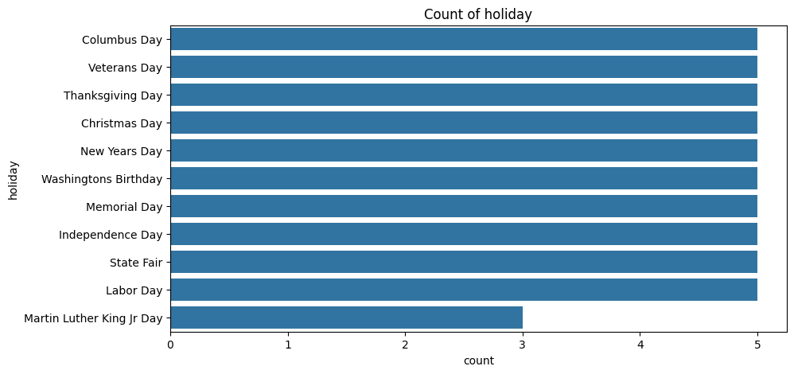

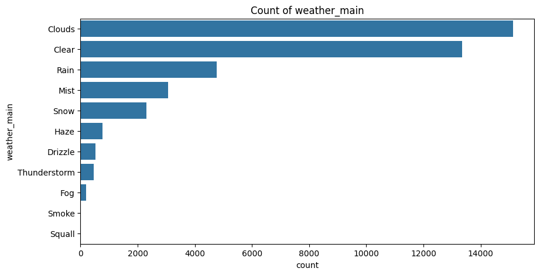

**Analysis of 'holiday' Variable**

* The 'holiday' variable contains categorical data indicating whether a given date is a holiday or not, and specifies the name of the holiday.
* There are 61 non-null entries in this column, indicating that only a small portion of the dataset corresponds to holidays.
* The majority of the entries in the 'holiday' column are null, suggesting that most dates in the dataset are regular days without holidays.
* For modeling purposes, it will be beneficial to create a binary feature indicating whether a date is a holiday or not, treating null values as non-holidays.

**Analysis of 'weather_main' Variable**

* The 'weather_main' variable provides categorical descriptions of the primary weather conditions during each observation.
* The most frequently occurring weather condition is 'Clouds', followed by 'Clear', 'Rain', and 'Mist'.
* Less common weather conditions include 'Snow', 'Fog', 'Haze', 'Thunderstorm', and 'Drizzle'.
* For modeling, it may be useful to group less frequent weather conditions into an 'Other' category to reduce the number of categories and avoid sparsity issues. And, we can discard the categorical levels that are inexistent in the dataset.

## Data Quality Check

### Analysis of 'snow_1h' Variable Quality

In this topic, we will investigate the quality of the `snow_1h` variable by cross-referencing it with the `weather_description` categorical variable to identify any inconsistencies or potential measurement errors. 

***Reliability Check: Snow Volume vs. Description***

We observed a major discrepancy between the sensor data and the weather description:

* **False Zeros:** In 2,264 cases, the description explicitly states conditions like "heavy snow", yet `snow_1h` reports 0. This suggests a systematic issue with the snow sensor or data logging during these events.
* **Noise:** There is only 1 instance of `snow_1h > 0` without a corresponding snow description, which is negligible.

**Decision:** Due to the high volume of "silent failures" (zeros during snow events), the `snow_1h` variable should be considered **low quality**. For modeling, deriving features from `weather_description` (e.g., `is_snowing`) will be more robust than using the raw `snow_1h` values.

## Time Series Visualization

In this section, we will visualize the time series data to identify trends, seasonal patterns, and any anomalies in the traffic volume over time. This will help us understand the temporal dynamics of the dataset and inform our modeling approach.

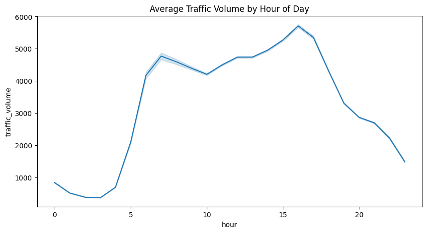

**Visualizing Traffic Volume by Hour of the Day**

By analyzing the average traffic volume per hour, we observe a clear bimodal distribution:

* Rush Hours: There are two distinct peaks in traffic volume, one in the morning (around 7-9 AM) and another in the evening (around 3-6 PM). This pattern aligns with typical commuting times, indicating higher traffic volume during these periods.
* Business Hours: Traffic remains relatively high during the day (between the peaks).
* Low Nighttime Traffic: Traffic volume drops significantly during nighttime hours (10 PM to 5 AM), reflecting reduced activity during these times.

*Conclusion*: The hour of the day is a strong predictor of traffic volume.

## Correlation/Bivariate Analysis

### Numeric x Numeric Analysis

**Scatter plot for temperature x traffic_volume**

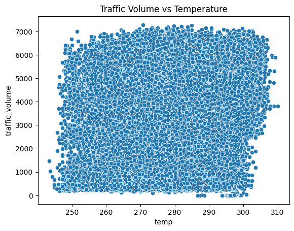

Apparently, there is no correlation between temperature and traffic volume. The correlation coefficient is very close to zero.

**Correlation Matrix and Heatmap**

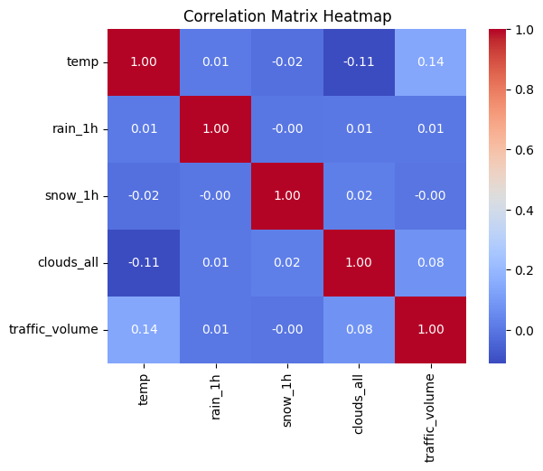

### Categorical x Numeric Analysis

**Box Plot of Traffic Volume by Weather Conditions**

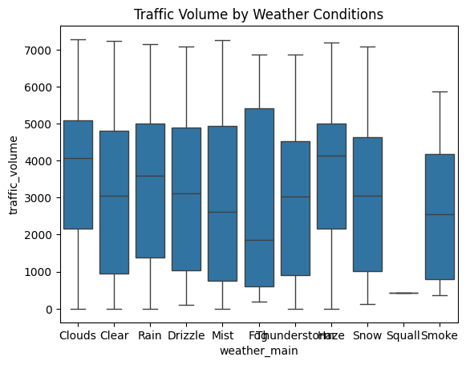

After analyzing the box plots of traffic volume by weather conditions, we can notice that is not some aparent relationship between weather and traffic volume. To make sure of this, let's filter only diurnal observations (6 AM to 8 PM) and re-plot the box plots.

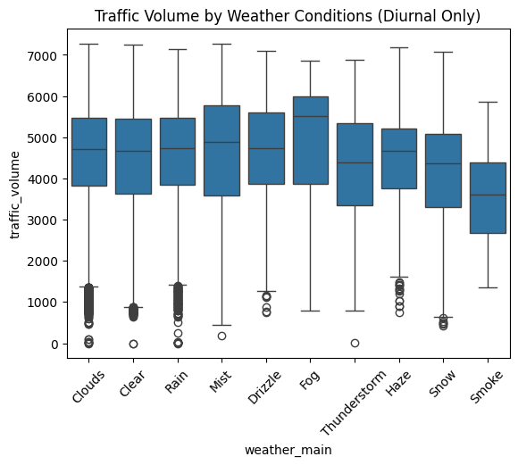
